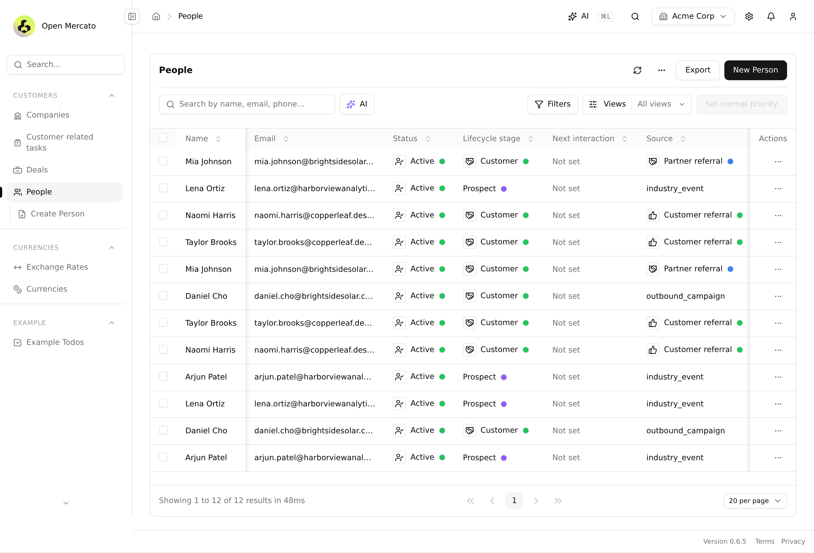
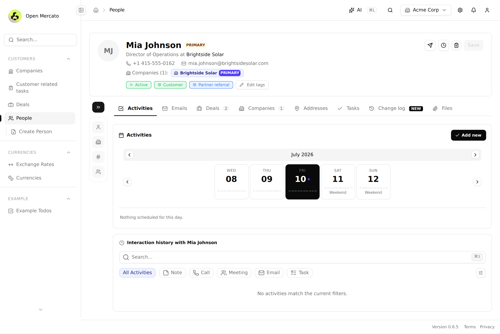
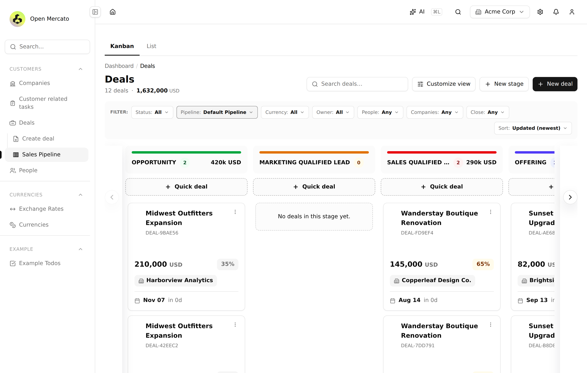
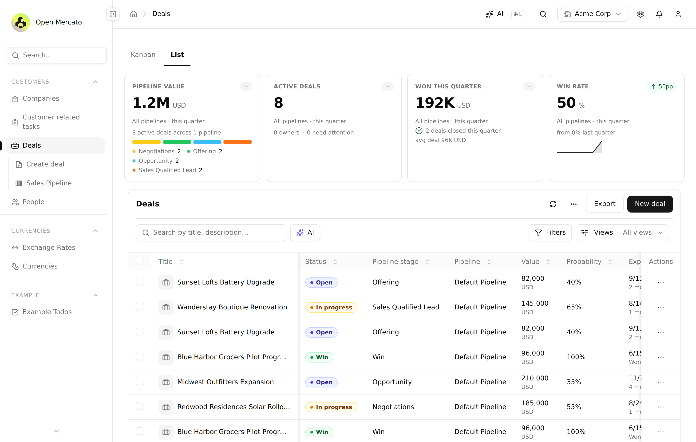
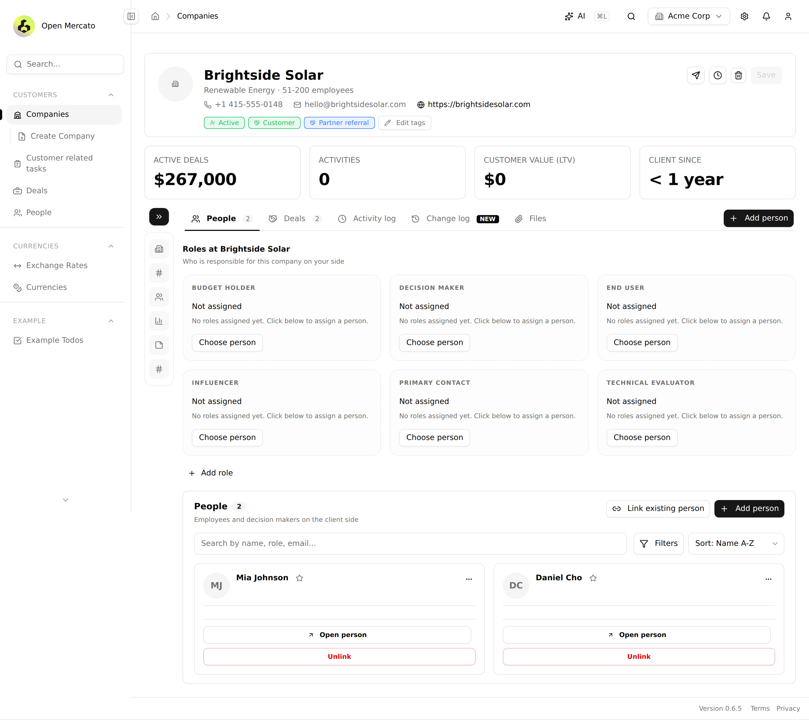
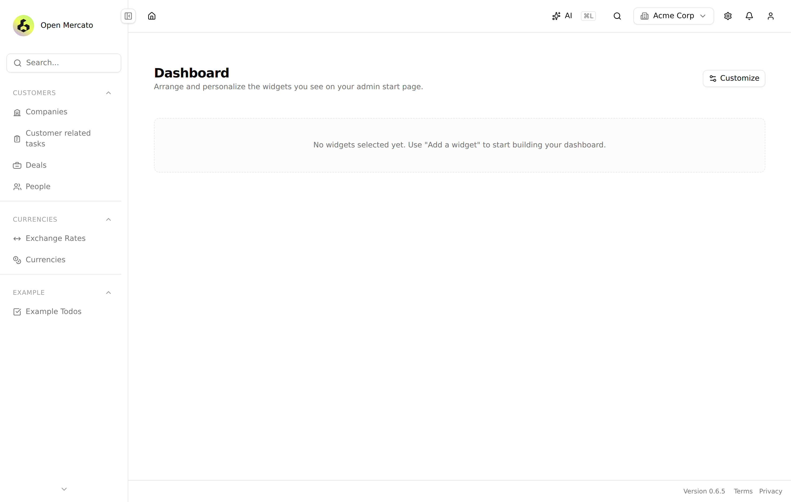

<p align="center">
  
</p>

<h1 align="center">🔀 Open Mercato — Backend Abstraction &amp; Porting Lab</h1>

<p align="center">
  <em>Port any <a href="https://github.com/open-mercato/open-mercato">Open Mercato</a> backend module to <b>.NET</b>, <b>Python</b>, <b>Go</b> — with <b>1:1 API compatibility</b>, driven by technology-agnostic AI skills.</em>
</p>

<p align="center">
  
  
  
  
</p>

> Port any [Open Mercato](https://github.com/open-mercato/open-mercato) backend module to **Python**, **.NET**, **Go** (and beyond) with **1:1 API compatibility** — driven by technology-agnostic AI skills.

Open Mercato's core is TypeScript + Next.js. Users keep asking: *"can the API run on .NET? Go? Python?"* — this repo is the answer. It holds:

1. 📐 **Specs** — technology-agnostic requirement specs distilled from the upstream codebase (module system, API contracts, data layer, queues, auth, runtime).
2. 🤖 **AI porting skills** — the *same* skills port any module to any target technology, using per-technology convention docs.
3. 📦 **Technology packages** — one runnable API + worker skeleton per technology, all speaking PostgreSQL + Redis + BullMQ-compatible queues.
4. 🔭 **Upstream tracking** — a pinned upstream commit and analysis docs, refreshable as Open Mercato core evolves.

**Status:** the **.NET port** has **9 modules** working end-to-end — **auth**, **directory**, **dashboards**, **customers** (the full CRM: people, companies, deals, interactions), **currencies**, **dictionaries**, **entities** (custom fields), **query_index**, **health_check**, plus **audit_logs** undo/redo (279 tests pass) — a CLI, OM-identical seeding, and a **testbench** that runs the *real* Open Mercato UI against the .NET API on release **v0.6.5**. See [`GETTING_STARTED.md`](GETTING_STARTED.md).

## 🏃 Try it now

Fastest path — the **.NET port** standalone (needs Docker):

```bash
cd packages/dotnet && make up          # postgres:17 + redis:7 + api + worker → :8080
```

Once it's up, log in as a seeded user and read the dashboard the port serves:

```bash
# login → 200 {"ok":true,"token":"<JWT>","redirect":"/backend"} + auth cookies
curl -s http://localhost:8080/api/auth/login \
  -d 'email=superadmin@acme.com' -d 'password=secret'

# dashboard layout for a bearer token (paste the token above)
curl -s http://localhost:8080/api/dashboards/layout -H "Authorization: Bearer <token>"
```

Seeded by OM-identical `mercato init`: `superadmin@acme.com` / `admin@acme.com` / `employee@acme.com`, all password `secret`.

The **CLI** (module-contributed commands + built-ins) drives seeding and admin tasks:

```bash
cd packages/dotnet
make greenfield                        # drop + migrate + seed the Acme tenant/org/users
make cli ARGS="list-users"             # add-user, set-password, add-org, list-orgs, dashboards seed-defaults, …
```

### 🧪 Run real Open Mercato against the port

The [`testbench/`](testbench/README.md) boots a *real* Open Mercato deployment and the .NET API against **one shared Postgres**: OM owns the schema, the port runs migrations-off, and a reverse proxy routes the ported `/api/*` (auth, directory, dashboards, customers, currencies, dictionaries, entities, query_index, audit_logs) to .NET while OM serves everything else. Shared `JWT_SECRET` + email lookup-hash pepper make auth interchangeable — you log into the real OM UI and the .NET port serves login, the dashboard, and the entire CRM. Design spec: [`specs/11-testbench.md`](specs/11-testbench.md). Full walkthrough: [`GETTING_STARTED.md`](GETTING_STARTED.md).

## 📸 See it running

Every screen below is the **real Open Mercato v0.6.5 UI** — but every byte of CRM data (people, companies, deals, pipelines, custom fields, search) is served by the **.NET port** (`dotnet-api`), not the TypeScript backend. Same paths, same JSON shapes, same auth — the frontend can't tell the difference.

<table>
  <tr>
    <td width="50%"><br/><sub><b>People list</b> — query-index-backed list, filters &amp; sort by base + custom fields (<code>12 results in 48ms</code>), served by .NET.</sub></td>
    <td width="50%"><br/><sub><b>Person 360</b> — profile, tags, linked companies, activity timeline &amp; interaction history.</sub></td>
  </tr>
  <tr>
    <td width="50%"><br/><sub><b>Deals pipeline (Kanban)</b> — drag-and-drop stages, per-stage totals, deal cards with value &amp; probability.</sub></td>
    <td width="50%"><br/><sub><b>Deals list &amp; KPIs</b> — pipeline value, active deals, win rate — all computed from .NET-served data.</sub></td>
  </tr>
  <tr>
    <td width="50%"><br/><sub><b>Company detail</b> — enriched profile, linked people, deals &amp; addresses.</sub></td>
    <td width="50%"><br/><sub><b>Dashboard</b> — customizable widget layout persisted through the ported <code>dashboards</code> module.</sub></td>
  </tr>
</table>

> Reproduce these yourself: bring up the [`testbench/`](testbench/README.md), then run `node testbench/e2e/shots.mjs` (regenerates every screenshot above against your local stack).

## 🗺️ Repository map

| Path | What lives there |
|---|---|
| [`specs/`](specs/) | Normative, tech-agnostic specs (`00`–`11`). Start at [`specs/00-overview.md`](specs/00-overview.md) |
| [`upstream/`](upstream/) | Pinned upstream reference: [`UPSTREAM.md`](upstream/UPSTREAM.md) + subsystem analyses in [`upstream/analysis/`](upstream/analysis/) |
| [`.claude/skills/`](.claude/skills/) | The 5 porting skills (see below) |
| [`packages/python/`](packages/python/) | 🐍 FastAPI + SQLAlchemy/Alembic + official BullMQ client |
| [`packages/dotnet/`](packages/dotnet/) | 🟣 ASP.NET Core minimal APIs + EF Core — **9 modules ported** (auth, directory, dashboards, customers, entities, query_index, currencies, dictionaries, audit_logs), CLI, OM-identical seeding |
| [`packages/golang/`](packages/golang/) | 🐹 chi + pgx + golang-migrate |
| [`testbench/`](testbench/README.md) | 🧪 Run a real Open Mercato UI against the .NET port over one shared Postgres |
| [`GETTING_STARTED.md`](GETTING_STARTED.md) | 🏁 Step-by-step: run the port standalone, run OM against it, port the next module |
| [`MODULES.md`](MODULES.md) | 📊 Porting tracker — module × technology status matrix |
| [`scripts/sync-upstream.sh`](scripts/sync-upstream.sh) | Refresh the upstream clone and diff against the pinned commit |
| [`AGENTS.md`](AGENTS.md) | Rules of the road for AI agents working in this repo |

## 🚀 Run an API server

Every technology package boots the same way — PostgreSQL 17, Redis 7, API host, queue worker:

```bash
# Docker (one command)
cd packages/python && make up      # 🐍  → http://localhost:8000/healthz
cd packages/dotnet && make up      # 🟣  → http://localhost:8080/healthz
cd packages/golang && make up      # 🐹  → http://localhost:8090/healthz
```

Native (no Docker) quickstarts live in each package's `README.md` — always the same `make` targets: `dev`, `worker`, `migrate`, `test`.

## 🚢 Deploy to production

Run the **real Open Mercato UI (with the AI assistant) on the .NET backend**, behind TLS, on your own
server — see [`deploy/README.md`](deploy/README.md). It has two turnkey sections: a **Hetzner Ubuntu
VPS** and **Dokploy**. The stack (OM app + `dotnet-api` + `dotnet-worker` + Postgres + Redis + Caddy)
lives in [`deploy/docker-compose.prod.yml`](deploy/docker-compose.prod.yml); copy
[`deploy/.env.example`](deploy/.env.example), set your domain + secrets + `OPENAI_API_KEY`, and
`docker compose --env-file deploy/.env -f deploy/docker-compose.prod.yml up -d --build`.

## 🤖 The porting loop

Technology-agnostic skills — the *same* skill drives a port to Python, .NET, Go, or any future target:

| Skill | What it does |
|---|---|
| `om-sync-upstream` | 🔄 Refresh the pinned upstream commit + regenerate stale analyses |
| `om-analyze-module` | 🔬 Distill one upstream module into a **port contract** (routes, schemas, events, queues, ACL) |
| `om-port-module` | 🛠️ Implement the contract 1:1 in a target technology package |
| `om-verify-parity` | ✅ Prove request/response, DB-schema and queue-name parity against the contract |
| `om-add-technology` | ➕ Scaffold a new `packages/<tech>/` following the [package standard](specs/09-technology-package-standard.md) |

Typical flow — port a module to two technologies **simultaneously**:

```
/om-analyze-module customers
/om-port-module customers python     # in parallel with…
/om-port-module customers dotnet
/om-verify-parity customers python
/om-verify-parity customers dotnet
```

## 🧭 Compatibility philosophy

- **Observable behavior is sacred** 🔒 — same paths, methods, status codes, JSON shapes, auth semantics, Postgres schema, queue/event names.
- **Internals are idiomatic** 🎨 — if the target language has a better solution than the TS original (validation, DI, ORM patterns), use it and record an ADR in `packages/<tech>/docs/decisions/`.
- **Everything shares infrastructure** 🧱 — PostgreSQL with real migrations, Redis, and BullMQ-compatible queues in every technology.
- **Upstream is pinned** 📌 — ports target the commit recorded in [`upstream/UPSTREAM.md`](upstream/UPSTREAM.md); bump deliberately with `om-sync-upstream`.

## 📊 Status

See [`MODULES.md`](MODULES.md) for the live module × technology matrix. The **.NET port** leads with **9 modules** ported and working (**279 tests pass**):

| Module | What the port serves |
|---|---|
| `auth` | Login, JWT + auth cookies, RBAC/feature checks, rate limiting |
| `directory` | Tenants, organizations, users, OM-identical `mercato init` seeding |
| `dashboards` | Widget layouts + data widgets (pipeline summary, customer growth) |
| `customers` | Full CRM — people, companies, deals, pipelines, interactions, tasks, entity links |
| `entities` | Custom-field definitions + values (EAV) with typing &amp; validation |
| `query_index` | `entity_indexes` read model — tokenized search, cf filter/sort, reindex/purge |
| `currencies` | Currencies + exchange rates |
| `dictionaries` | Lookup dictionaries (status, lifecycle stage, source, …) |
| `audit_logs` | Action log + **undo/redo** wired to OM's Undo button |

Plus a CLI, OM-identical seeding, and the [`testbench/`](testbench/README.md) running a real Open Mercato **v0.6.5** UI against the port. Next up across all technologies: the remaining domain modules, and bringing **Python** and **Go** up to the same coverage.
